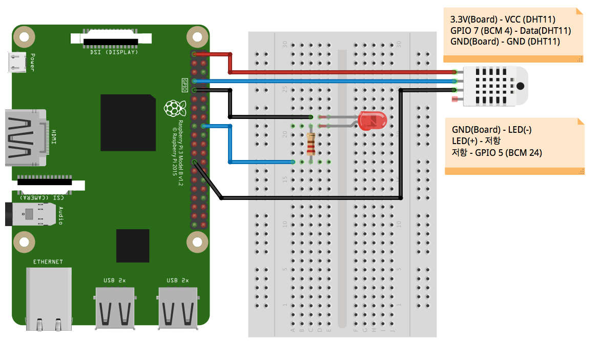

# IoTMaker-raspberry pi 연동

## 하드웨어 구성도



1. LED 제어 배선
	- 라즈베리파이 **GND**(보드 9번핀)을 **LED 음극**(캐소드, 짧은 단자)에 연결
	- **LED 양극**(애노드, 긴 단자)을 **저항 (330~1K 옴)**에 연결
	- 저항의 나머지 한 끝을 라즈베리파이 **GPIO5 (BCM 24, 보드 18번핀)** 연결

2. DHT-11 온습도 센서
	- 라즈베리파이 **3.3V**(보드 1번핀)을 DHT-11의 VCC 핀과 연결
	- 라즈베리파이 **GPIO7** (BCM 4, 보드 7번핀)을 DHT-11의 Data 핀과 연결
	- 라즈베리파이 **GND** (보드 25번핀)을 DHT-11의 GND 핀과 연결

## IoTMakers 준비
1. IoTMakers에 접속해서 디바이스를 등록한다.
처음 가입하면 다음과 같이 디바이스 등록 화면을 볼 수 있다.

	

2. 디바이스 명을 입력하고 프로토콜 유형을 선택한다.

	

3. 디바이스 연결 상태: OFF 확인

	

4. 디바이스 상세 정보를 미리 확인해 둔다.
	- 디바이스 아이디
	- 디바이스 패스워드
	- Gateway 연결 ID

	
	
5. IoTMakers에서 앞서 등록한 디바이스에 LED on/off를 위한 제어태그를 등록한다.
	- **Tag Stream ID**: *LED*
	- **Tag Stream Type**: *제어*
	- **Value Type**: *문자형식*

	
	
6. IoTMakers에서 앞서 등록한 디바이스에 온도수집을 위한 수집태그를 등록한다.
	- **Tag Stream ID**: *temperature*
	- **Tag Stream Type**: *수집*
	- **Value Type**: *숫자형식*

	

## 예제 실행해보기

1. 라즈베리파이 터미널 혹은 PuTTY로 라즈베리파이에 접속한다.
	- [SSH 클라이언트(PuTTY) 사용하여 라즈베리파이에 접속](raspberrypi.html#3.2) 참조
2. 	[IoTMaker-raspberry](https://github.com/kwanulee/IoTMakers-raspberry) 예제 다운로드
	
	```
	pi@raspberrypi:~$ git clone https://github.com/kwanulee/IoTMakers-raspberry.git
	```

	- 예제 프로젝트는 다음과 같이 구성되어 있다.
		- dist 폴더: IoTMakers SDK Jar 파일이 위치한 폴더.
		- lib 폴더: IoTMakers SDK Jar파일을 위한 외부 라이브러리를 첨부한 폴더
		- **IoTSDK.properties**: IoTMakers SDK에서 사용하는 property 파일
		- **dhtlib.py**: DHT11 센서에서 온도 값 읽는 파이션 예제
		- **raspberry.java**: IoTMaker와 LED, DHT11 센서 연동 예제
		- Sample.java: 샘플 파일
		- SampleLight.java: 샘플 파일 (Wrapping API 사용)

3. **IoTSDK.properties** 파일을 열어 아래와 같이 수정한다.
	- 디바이스 정보는 아래와 같이 디바이스 상세 정보에서 확인할 수 있다. 예시와 같이 연동하고자하는 디바이스 정보를 입력한다

	
	

4. 예제 컴파일 및 실행하기
	- 컴파일
	
	```
	pi@raspberrypi:~$ cd IoTMakers-raspberry
	pi@raspberrypi:~/IoTMakers-raspberry$ make
  
	```
	
	- 실행하기
	
	```
	pi@raspberrypi:~/IoTMakers-raspberry$ make run
	```
	